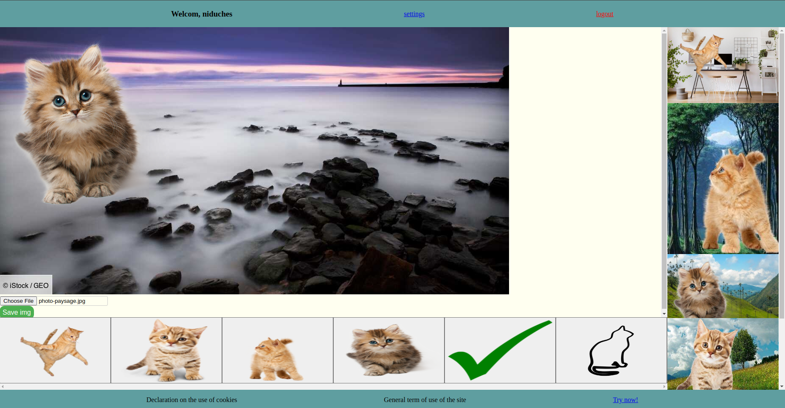

# Camagru
A small instagram-like website with JavaScript, PHP, MySQL and Docker, allowing its users to create and share photo montage



### Built with
* PHP
* Javascript
* MySQL
* Docker

### Set up
add .env file at the root of the repo with
```
MYSQL_PASSWORD=*****
MYSQL_ROOT_PASSWORD=*****
EMAIL_PASSWORD=*****
EMAIL_USER=email_user
EMAIL_PROVIDER=gmail.com
```

### Run
```
docker compose up
```
